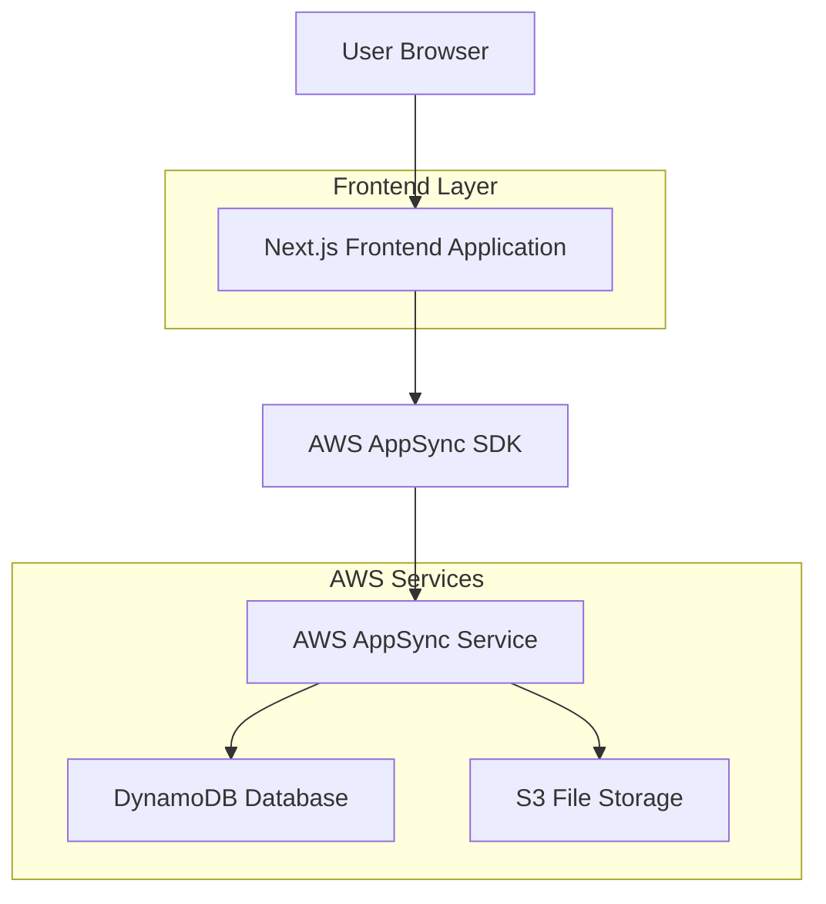
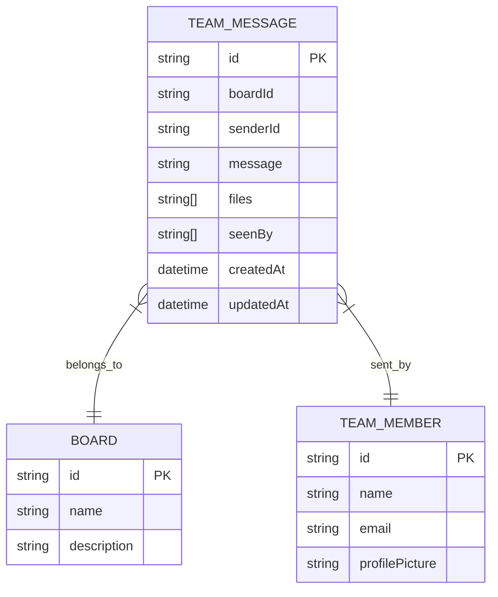

# Team Messaging Application - Technical Architecture Document

## 1. Architecture Design



## 2. Technology Description
- Frontend: Next.js@14 + TypeScript + Tailwind CSS@3 + AWS Amplify SDK
- Backend: AWS AppSync (GraphQL API)
- Database: DynamoDB (managed by AppSync)
- File Storage: Amazon S3
- Real-time: AppSync Subscriptions over WebSocket

## 3. Route Definitions
| Route | Purpose |
|-------|---------|
| / | Main chat interface with real-time messaging |
| /api/upload | File upload endpoint for message attachments |

## 4. API Definitions

### 4.1 Core API

**Message Operations**
```graphql
# Create a new message
mutation CreateTeamMessage($input: CreateTeamMessageInput!) {
  createTeamMessage(input: $input) {
    id
    boardId
    senderId
    message
    files
    seenBy
    createdAt
    updatedAt
  }
}

# Get messages for a board
query QueryTeamMessagesByBoardId($boardId: ID!, $first: Int, $after: String) {
  queryTeamMessagesByBoardIdIndex(boardId: $boardId, first: $first, after: $after) {
    items {
      id
      boardId
      senderId
      message
      files
      seenBy
      createdAt
      updatedAt
    }
    nextToken
  }
}

# Real-time message subscription
subscription OnCreateTeamMessage($boardId: ID) {
  onCreateTeamMessage(boardId: $boardId) {
    id
    boardId
    senderId
    message
    files
    seenBy
    createdAt
    updatedAt
  }
}
```

**TypeScript Interfaces**
```typescript
interface TeamMessage {
  id: string;
  boardId: string;
  senderId: string;
  message: string;
  files?: string[];
  seenBy?: string[];
  createdAt: string;
  updatedAt: string;
}

interface TeamMember {
  id: string;
  name: string;
  email: string;
  profilePicture: string;
}

interface Board {
  id: string;
  name: string;
  description: string;
}
```

## 5. Data Model

### 5.1 Data Model Definition


### 5.2 Dummy Data Definition

**Board Data**
```json
{
  "id": "board-1",
  "name": "Project Alpha Team",
  "description": "Main communication channel for Project Alpha development team"
}
```

**Team Members Data**
```json
[
  {
    "id": "user-1",
    "name": "Alice Johnson",
    "email": "alice.johnson@company.com",
    "profilePicture": "https://images.unsplash.com/photo-1494790108755-2616b612b786?w=150"
  },
  {
    "id": "user-2",
    "name": "Bob Smith",
    "email": "bob.smith@company.com",
    "profilePicture": "https://images.unsplash.com/photo-1507003211169-0a1dd7228f2d?w=150"
  },
  {
    "id": "user-3",
    "name": "Carol Davis",
    "email": "carol.davis@company.com",
    "profilePicture": "https://images.unsplash.com/photo-1438761681033-6461ffad8d80?w=150"
  },
  {
    "id": "user-4",
    "name": "David Wilson",
    "email": "david.wilson@company.com",
    "profilePicture": "https://images.unsplash.com/photo-1472099645785-5658abf4ff4e?w=150"
  },
  {
    "id": "user-5",
    "name": "Emma Brown",
    "email": "emma.brown@company.com",
    "profilePicture": "https://images.unsplash.com/photo-1544005313-94ddf0286df2?w=150"
  }
]
```

### 5.3 Environment Configuration

**Required Environment Variables**
```bash
APPSYNC_HTTPS_MESSAGE_API_ENDPOINT=https://qjy5mxqcn5d2xf44d6jvsaejgi.appsync-api.us-east-1.amazonaws.com/graphql
APPSYNC_WS_MESSAGE_API_ENDPOINT=wss://qjy5mxqcn5d2xf44d6jvsaejgi.appsync-realtime-api.us-east-1.amazonaws.com/graphql
APPSYNC_API_KEY=da2-567432109876543210
NEXT_PUBLIC_AWS_REGION=us-east-1
```