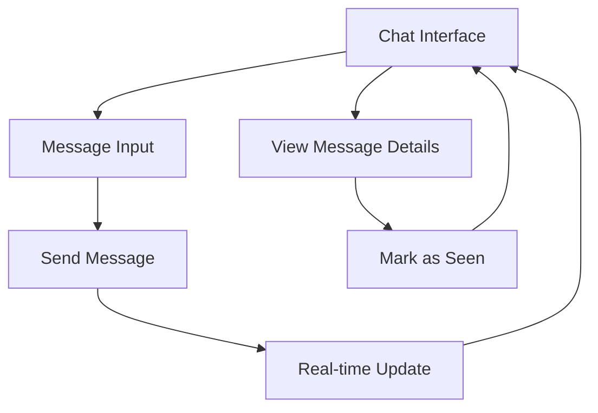

# Team Messaging Application - Product Requirements Document

## 1. Product Overview
A real-time team messaging application built with Next.js and AWS AppSync that enables seamless communication within project teams. The application focuses on core messaging functionality with real-time updates, file sharing capabilities, and message tracking features to enhance team collaboration and productivity.

## 2. Core Features

### 2.1 User Roles
| Role | Registration Method | Core Permissions |
|------|---------------------|------------------|
| Team Member | Pre-configured dummy data | Can send messages, view all messages, mark messages as seen |

### 2.2 Feature Module
Our team messaging application consists of the following main pages:
1. **Chat Interface**: Real-time message display, message input form, user avatars, message metadata
2. **Message Management**: Message creation, file attachments, seen status tracking

### 2.3 Page Details
| Page Name | Module Name | Feature description |
|-----------|-------------|---------------------|
| Chat Interface | Message List | Display messages in chronological order with real-time updates via AppSync subscriptions |
| Chat Interface | Message Input | Send text messages and file attachments with validation and error handling |
| Chat Interface | User Avatars | Show sender profile pictures and names for each message |
| Chat Interface | Message Metadata | Display message timestamps, seen status indicators, and file attachment previews |
| Chat Interface | Real-time Updates | Automatically receive new messages, updates, and deletions through WebSocket connections |

## 3. Core Process
**Team Member Flow:**
1. User opens the chat interface and sees existing messages
2. User types a message in the input field
3. User optionally attaches files
4. User sends the message, which appears immediately in the chat
5. Other team members receive the message in real-time
6. Users can see who has viewed each message

## 4. User Interface Design

### 4.1 Design Style
- **Primary Colors**: Blue (#3B82F6) for active elements, Gray (#6B7280) for secondary text
- **Secondary Colors**: Green (#10B981) for online status, Light Gray (#F3F4F6) for message bubbles
- **Button Style**: Rounded corners with subtle shadows and hover effects
- **Font**: Inter or system fonts, 14px for body text, 12px for metadata
- **Layout Style**: Clean card-based design with left sidebar for team info and main chat area
- **Icons**: Feather icons or Heroicons for consistent, minimal design

### 4.2 Page Design Overview
| Page Name | Module Name | UI Elements |
|-----------|-------------|-------------|
| Chat Interface | Message List | Scrollable container with message bubbles, sender avatars (40px circular), timestamps in gray text |
| Chat Interface | Message Input | Bottom-fixed input bar with text field, file upload button, and send button (blue, rounded) |
| Chat Interface | User Avatars | 32px circular profile images with online status indicators (green dot) |
| Chat Interface | Message Metadata | Small gray text showing time, seen count with checkmark icons |

### 4.3 Responsiveness
Desktop-first design with mobile-adaptive layout. Touch-optimized input controls and gesture support for mobile devices. Responsive breakpoints at 768px and 1024px for tablet and desktop views.